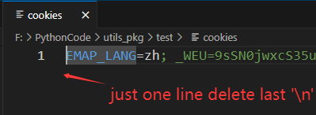

## A Package of some useful utils


> There is only one tool now, you are very welcome to submit new utils 

- [2025.4.12] CStark have provided a util for strong badminton tickets in SZU. 🔥 


### Set up

```python
git clone https://github.com/ChinaStark/utils_pkg.git

cd utils_pkg

# setup
pip install .
```

## Get and write cookies 
### step 1

### step 2

### step 3
Copy the `path/to/cookies` to the variant `cookie_file`
## Run
> [!NOTE]
> Before you run, please write the cookies in you file and the path should give to the variant cookie_file.

```python
from CStack_utils import *
you_name = "xxx"
you_id = "xxx"
YYLX="2.0"  # 预约类型，目前羽毛球是1.0，健身房和排球是2.0
typeOfSport = "007" # 预约什么运动 001 羽毛球  003 排球
appointment_day = "2025-05-14"
appointment_time_start = "21:00" # 意愿开始时间
cookie_file="./cookies"
cnt = 1 # 默认是约一场，你可以改，注意一个时间段只能约一场
sportGet.strat_appointment(appointment_day,
                           appointment_time_start,
                           you_name,
                           you_id,
                           cookie_file,
                           sport_type=typeOfSport,
                           wait_until_target=True, # 提前3分钟约
                           yylx=YYLX,
                           cnt = cnt)
```


