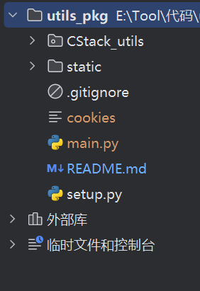
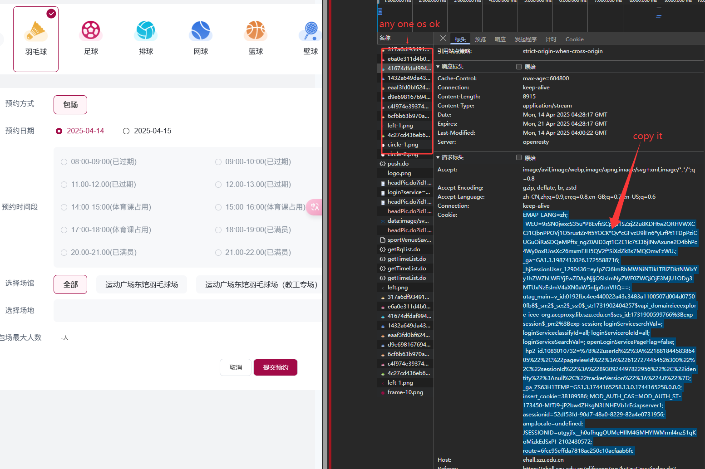

## A Package of some useful utils


> There is only one tool now, you are very welcome to submit new utils 

- [2025.4.12] CStark have provided a util for strong badminton tickets in SZU. 🔥 


### Set up

```python
git clone https://github.com/ChinaStark/utils_pkg.git

cd utils_pkg

# setup
pip install .
```

## Usage
### step 1 
Follow the code structure to create files cookies and main.py
### Code struct


### step 2
Get and write cookies into cookies file.


### step 3
Copy the code below into main.py and configurate the parameters.
```python
from CStack_utils import *

you_name = ""  # 姓名
you_id = ""  # 学号
YYLX = "1.0"  # 预约类型，目前羽毛球、排球、网球、壁球、乒乓球是1.0，健身房、足球、篮球是2.0
typeOfSport = "001"  # 001羽毛球  002足球  003排球  004网球  005篮球  006壁球  007一楼重量型健身  008二楼有氧型健身  013乒乓球
appointment_day = "2025-12-07"  # 预约日期
appointment_time_start = "08:00"  # 预约开始时间，格式：hh:mm， 示例："08:00"
cookie_file = "./cookies"   # 间隔超过30分钟，记得更新一下cookies
cnt = 1  # 预约场次数目，优先同场次连续时间段，其次随机场次连续时间段，你可以改，注意一个时间段只能约一场，单人最多约两场

# 预约羽毛球特定场地专用字段
campus = "1"   # 指定校区， "1"=粤海  "2"=丽湖
# 指定羽毛球场地，不指定则随机
# 粤海：A3-A8，B3-B8，C3-C8，D3-D8，示例："A3"；
# 丽湖：至畅羽毛球1-10号场，至快羽毛球1-12号场，示例："至畅羽毛球1号场"
target_room = ""

sportGet.strat_appointment(appointment_day,
                           appointment_time_start,
                           you_name,
                           you_id,
                           cookie_file,
                           sport_type=typeOfSport,
                           wait_until_target=True,
                           yylx=YYLX,
                           cnt=cnt,
                           campus=campus,
                           target_room=target_room
                           )
```


